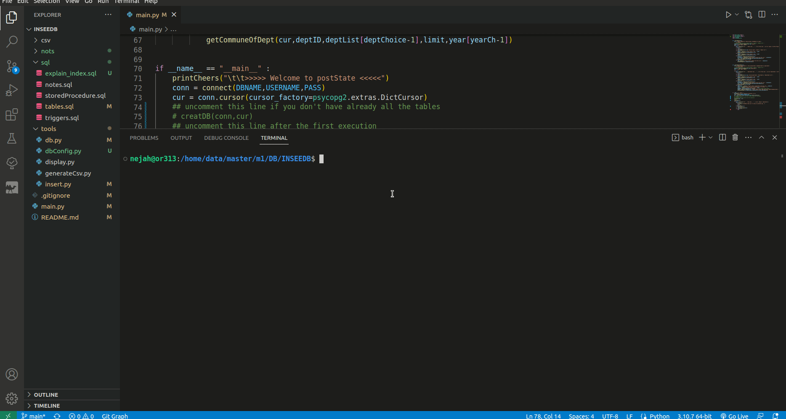

<h1>
INSEEDB app with python: 
</h1>


## What is This

---

This is a Python application that maid to creat and manage [**INSEE**](https://www.insee.fr/fr/information/6800675) databases using ([psycopg2](https://www.psycopg.org/docs/index.html)).

## 🚀 Installation

Clone this repository by running this line :

```console
~$ git clone https://github.com/NiNejah/INSEEDB.git
```


## 📗 Usage
1. Go to [db config](./tools/dbConfig.py) and change it to your own values.

## RUN 
```console
~$ python3 main.py
```

**Important:** 
In [main.py](./main.py) 
*  uncomment this line if you don't have already all the tables **creatDB(conn,cur)** 
   (all the tables creation are in [tables](./sql/tables.sql))
*  comment this line after the first execution  **insertAll(conn , cur)**


## demostation :



I have already all the tables that's why we see the Warning message to comment  **insertAll(conn , cur)** 


### info 
* all the fill files in [./csv](./csv/) gentated by a python script from [dossier_complet.csv](https://www.insee.fr/fr/statistiques/6456192) and from [Official geographic code ](https://www.insee.fr/fr/information/6800675)

 
